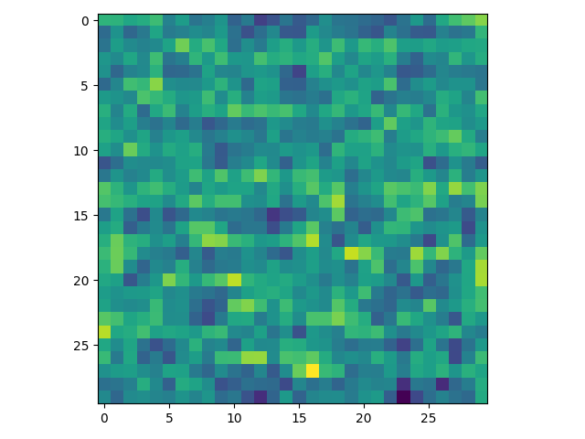
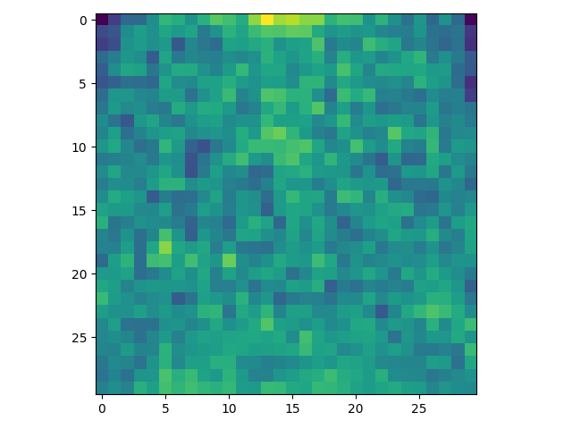
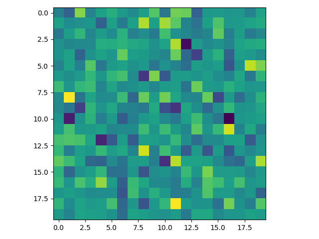
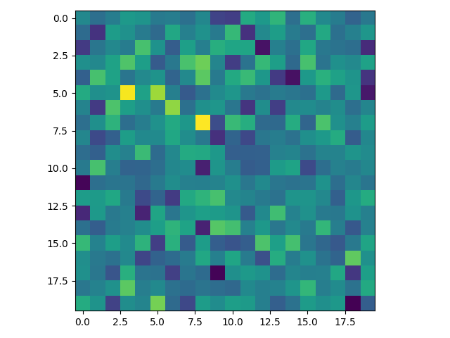
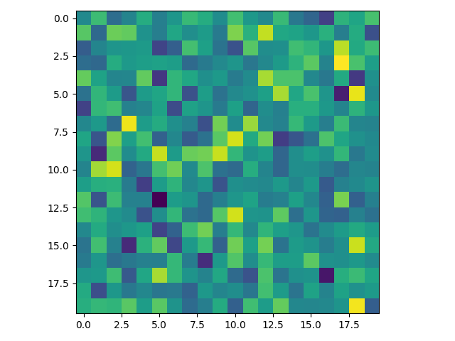

# Natural Scene Classification Using Neural Network

This repository contains the implementations of single layer and multi layer neural networks to classify natural scene images into 6 classes which are buildings, forest, glacier, mountain, sea and street. 

## Run

### Train

    python train.py

### Test

    python test.py

For more options, please refer to options.py

## Dataset

In this project, [natural scene dataset on Kaggle](https://www.kaggle.com/puneet6060/intel-image-classification) is used. This dataset contains 150x150 natural scene images and their labels. There are 6 labels: buildings, forest, glacier, mountain, sea and street. Below is the table of image numbers for train, validation and test sets. After processing those images, we use them to train the network, tune the hyperparameters and validate the architecture.

| Data | # Images |
| :- | -: |
| Train | 14034 |
| Validation | 3000 |
| Test | 3650 |

## Data Preparation

To perform this classification task, I use vectorized pixel representations of the given images. To use vanilla image features, I resize images to 30x30 firstly. Then, I convert them to grayscale images. After flattening those 30x30 matrices to 900x1 vectors, I normalize vector values between 0 and 1 instead of using 0 and 255 image pixel values. By doing so, the network learns parameters faster. After normalization, images are processed and vanilla image features are ready to use.

Beside the vanilla features, I use deep image feature of VGG-19 network. VGG-19 is a deep Convolutional Neural Networks (CNN) used for image classification task. Below is the architecture of this network. This network is mainly classifies 1000 classes. Therefore, the size of the last fully connected layer is 1000. To use deep image feature of VGG-19 network, I change model mode to evaluation and remove the last fully connected layer. So when I forward an image to this edited network, I obtain an image feature vector of size 4096. Note that to forward an image to this network, the image must be preprocessed and convert to tensor.

After preprocessing the images, I forward the images to last fully connected layer removed VGG-19 network and obtain the feature vectors. Therefore, I obtain the extracted deep image features which give important information about images.

## Neural Network

Although I used single layer, 1-hidden layer and 2-hidden layer neural networks in the experiments, my neural network implementation is reproducible so that any number of hidden layer can be used in the neural network. To do so,  I firstly take input layer size, hidden layer size, hidden neuron number and output layer size as argument. Then, I create an architecture from these arguments so that there are current layer size times next layer size weights between current layer and next layer, and biases of next layer size number. While initializing weights and biases, I am inspired by the [implementation of PyTorch](https://discuss.pytorch.org/t/how-are-layer-weights-and-biases-initialized-by-default/13073). After taking standard deviation with respect to current layer size, I initialize weights and biases randomly in the range of negative standard deviation to positive standard deviation.

As in any deep learning approaches, there are forward passes followed by backward passes in the neural networks. I use mini-batch gradient descent algorithm to minimize the error in the model. In the forward pass, I simply apply the following formula for each neuron in each layer.

In each layer except the output layer, I apply activation function to the output of the above formula for obtaining non-linear outputs. After applying activation function to output, I keep inputs, weights, biases, outputs and activated outputs to use in the backward pass. In the output layer, applying above formula gives the scores for each class. Therefore, I only forward the inputs, obtain the scores and keep inputs, weights and biases. If this is a training, I pass the obtained scores to backward pass and if it is not, I simply return the label with the highest score as prediction.

After forward pass, I obtain scores. Then I use these scores and ground truths in backpropagation. In the backpropogation, I first apply softmax to these scores to obtain probabilities and log probabilities of the predicted classes. As derivative of the softmax function, I use the mentioned formula [here](http://bigstuffgoingon.com/blog/posts/softmax-loss-gradient/). After that, I calculate the loss and the derivative of the objective/loss function with respect to the obtained output. I use cross-entropy, sum of squared and mean squared error functions. In the cross-entropy error, I calculate loss as the sum of negative log-likelihood of the correct labels. As the derivative, I use the unified formula of the softmax and cross-entropy error derivatives.

After obtaining loss and the derivative of the objective/loss function with respect to the obtained output, I pass the error obtained towards backward as chain rule. In the last layer I only calculate the weight gradients, but in the other layers, I calculate weight gradients and multiply them with activation function derivatives. By applying chain rule, I obtain the gradients of the weights and biases. I keep them to use those derivatives in the weight updates. After that, I return the loss and calculated gradients to update weights and optimize the error obtained.

## Experiments

In my experiments, I test number of units in the hidden layer with 10, 50, 100, 200 and 500, batch size with 16, 32, 64 and 128, learning rates with 0.005, 0.01, 0.05 and 0.1, activations functions with Sigmoid, tanh and ReLU, objective functions with cross-entropy error (CEE), sum of squared error (SSE) and mean squared error (MSE). I train the model with training set and validate its performance with validation set. According to validation accuracies, I decide the hyperparameters. After that I give the test set accuracy of the best model. Note that I train the model 50 epoch for 30x30 image features and 10 epoch for VGG-19 image features.

### Single Layer Neural Network

#### Hyperparameter Tuning

| <!-- --> | <!-- --> | <!-- --> | <!-- --> | <!-- --> | <!-- --> | <!-- --> | <!-- --> | <!-- --> | <!-- -->| <!-- --> | <!-- --> | <!-- --> | <!-- --> | <!-- --> | <!-- --> | <!-- --> |
| ---         | ---   | ---  | ---   | ---   | ---   | ---   | ---   | ---   | ---   | ---   | ---      | ---  | ---   | ---   | ---  | --- |
| **Batch Size**  | 16    | 16   | 16    | 16    | 32    | 32    | 32    | 32    | 64    | 64    | 64       | 64   | 128   | 128   | 128  | 128 |
| **Learning Rate**          | 0.005 | 0.01 | 0.05  | 0.1   | 0.005 | 0.01  | 0.05  | 0.1   | 0.005 | 0.01  | 0.05     | 0.1  | 0.005 | 0.01  | 0.05 | 0.1 |
| **Max Validation Acc** | 43.23 | 43.7 | 42.33 | 41.57 | 41.83 | 43.67 | 43.37 | 42.43 | 38.67 | 42.03 | **43.8** | 43.4 | 36.8  | 39.33 | 43.3 | 43.63 |

| Loss | Accuracy |
| - | - |
|  |  |

| <!-- --> | <!-- --> | <!-- --> | <!-- --> | <!-- --> | <!-- --> | <!-- --> | <!-- --> | <!-- --> | <!-- -->|
| ---         | ---   | ---  | ---   | ---   | ---   | ---   | ---   | ---   | ---   |
| **Objective Function** | Log    | Log   | Log    | SSE    | SSE    | SSE    | MSE    | MSE    | MSE    |
| **Activation Function** | Sigmoid | Tanh | ReLU  | Sigmoid | Tanh | ReLU  | Sigmoid | Tanh | ReLU  |
| **Max Validation Acc** | **44.00** | 43.77 | 43.73 | 37.73 | 40.00 | 40.70 | 43.10 | 43.23 | 43.20 |

| Loss | Accuracy |
| - | - |
|  |  |

| buildings | forest | glacier | mountain | sea | street |
| - | - | - | - | - | - |
|  |  |  |  |  |  |

Below is the confusion matrix of the best model for this architecture on the test set and its test accuracy is **44.19**.

#### VGG-19 Features

| Loss | Accuracy |
| - | - |
|  |  |

The maximum validation accuracy this model get is **91.93**. Below is the confusion matrix of the best model for this architecture on the test set and its test accuracy is **93.53**.

### 1-Hidden Layer Neural Network

#### Hyperparameter Tuning

| <!-- -->         | <!-- -->   | <!-- -->   | <!-- -->   | <!-- -->   | <!-- -->   | <!-- -->   | <!-- -->   | <!-- -->   | <!-- -->   | <!-- -->   | <!-- -->   | <!-- -->   | <!-- -->   | <!-- -->   | <!-- -->       | <!-- -->   | <!-- -->   | <!-- -->   | <!-- -->   | <!-- -->   | <!-- -->   | <!-- -->   | <!-- -->   | <!-- -->   | <!-- -->   | <!-- -->   | <!-- -->   | <!-- -->   | <!-- -->   | <!-- -->   | <!-- -->   | <!-- -->   | <!-- -->   | <!-- -->   | <!-- -->   | <!-- -->   | <!-- -->   | <!-- -->   | <!-- -->   | <!-- -->   | <!-- -->   | <!-- -->   | <!-- -->   | <!-- -->   | <!-- -->   | <!-- -->   | <!-- -->   | <!-- -->   | <!-- -->   | <!-- -->   | <!-- --> |<!-- -->   | <!-- -->   | <!-- -->   | <!-- -->   | <!-- -->   | <!-- -->   | <!-- -->   | <!-- -->   | <!-- -->   | <!-- -->   | <!-- -->   | <!-- -->   | <!-- -->   | <!-- -->   | <!-- -->   | <!-- -->   | <!-- -->   | <!-- -->   | <!-- -->   | <!-- -->   | <!-- -->   | <!-- -->   | <!-- -->   | <!-- -->   | <!-- -->   | <!-- -->   | <!-- -->   | <!-- -->   | <!-- --> |
| ---         | ---   | ---   | ---   | ---   | ---   | ---   | ---   | ---   | ---   | ---   | ---   | ---   | ---   | ---   | ---       | ---   | ---   | ---   | ---   | ---   | ---   | ---   | ---   | ---   | ---   | ---   | ---   | ---   | ---   | ---   | ---   | ---   | ---   | ---   | ---   | ---   | ---   | ---   | ---   | ---   | ---   | ---   | ---   | ---   | ---   | ---   | ---   | ---   | ---   | ---   | ---   | ---   | ---   | ---   | ---   | ---   | ---   | ---   | ---   | ---   | ---   | ---   | ---   | ---   | ---   | ---   | ---   | ---   | ---   | ---   | ---   | ---   | ---   | ---   | ---   | ---   | ---   | ---   | ---   | --- |
| **Batch Size**  | 16    | 16    | 16    | 16    | 16    | 16    | 16    | 16    | 16    | 16    | 16    | 16    | 16    | 16    | 16        | 16    | 16    | 16    | 16    | 16    | 32    | 32    | 32    | 32    | 32    | 32    | 32    | 32    | 32    | 32    | 32    | 32    | 32    | 32    | 32    | 32    | 32    | 32    | 32    | 32    | 64    | 64    | 64    | 64    | 64    | 64    | 64    | 64    | 64    | 64    | 64    | 64    | 64    | 64    | 64    | 64    | 64    | 64    | 64    | 64    | 128   | 128   | 128   | 128   | 128   | 128   | 128   | 128   | 128   | 128   | 128   | 128   | 128   | 128   | 128   | 128   | 128   | 128   | 128   | 128 |
| **Learning Rate**          | 0.005 | 0.005 | 0.005 | 0.005 | 0.005 | 0.01  | 0.01  | 0.01  | 0.01  | 0.01  | 0.05  | 0.05  | 0.05  | 0.05  | 0.05      | 0.1   | 0.1   | 0.1   | 0.1   | 0.1   | 0.005 | 0.005 | 0.005 | 0.005 | 0.005 | 0.01  | 0.01  | 0.01  | 0.01  | 0.01  | 0.05  | 0.05  | 0.05  | 0.05  | 0.05  | 0.1   | 0.1   | 0.1   | 0.1   | 0.1   | 0.005 | 0.005 | 0.005 | 0.005 | 0.005 | 0.01  | 0.01  | 0.01  | 0.01  | 0.01  | 0.05  | 0.05  | 0.05  | 0.05  | 0.05  | 0.1   | 0.1   | 0.1   | 0.1   | 0.1   | 0.005 | 0.005 | 0.005 | 0.005 | 0.005 | 0.01  | 0.01  | 0.01  | 0.01  | 0.01  | 0.05  | 0.05  | 0.05  | 0.05  | 0.05  | 0.1   | 0.1   | 0.1   | 0.1   | 0.1 |
| **Hidden Unit Number**    | 10    | 50    | 100   | 200   | 500   | 10    | 50    | 100   | 200   | 500   | 10    | 50    | 100   | 200   | 500       | 10    | 50    | 100   | 200   | 500   | 10    | 50    | 100   | 200   | 500   | 10    | 50    | 100   | 200   | 500   | 10    | 50    | 100   | 200   | 500   | 10    | 50    | 100   | 200   | 500   | 10    | 50    | 100   | 200   | 500   | 10    | 50    | 100   | 200   | 500   | 10    | 50    | 100   | 200   | 500   | 10    | 50    | 100   | 200   | 500   | 10    | 50    | 100   | 200   | 500   | 10    | 50    | 100   | 200   | 500   | 10    | 50    | 100   | 200   | 500   | 10    | 50    | 100   | 200   | 500 |
| **Max Validation Acc** | 45.80 | 47.20 | 48.50 | 48.50 | 48.97 | 46.33 | 50.47 | 50.90 | 51.07 | 52.53 | 47.77 | 51.83 | 53.07 | 54.53 | **55.50** | 39.53 | 51.50 | 51.17 | 53.60 | 53.63 | 43.57 | 44.60 | 45.00 | 45.67 | 45.50 | 45.93 | 48.23 | 47.70 | 48.27 | 48.90 | 46.97 | 52.47 | 54.10 | 53.73 | 54.47 | 47.13 | 51.90 | 53.67 | 54.53 | 54.80 | 39.73 | 40.30 | 40.80 | 40.63 | 41.37 | 43.83 | 45.20 | 44.77 | 45.90 | 46.37 | 47.43 | 50.63 | 51.63 | 52.87 | 53.00 | 47.93 | 52.10 | 53.13 | 53.97 | 54.83 | 37.53 | 36.27 | 37.20 | 36.80 | 38.00 | 38.13 | 40.17 | 40.27 | 41.03 | 41.30 | 46.97 | 48.57 | 49.23 | 49.43 | 49.93 | 45.77 | 50.53 | 51.47 | 51.90 | 53.03 |

| Loss | Accuracy |
| - | - |
|  |  |

| <!-- --> | <!-- --> | <!-- --> | <!-- --> | <!-- --> | <!-- --> | <!-- --> | <!-- --> | <!-- --> | <!-- -->|
| ---         | ---   | ---  | ---   | ---   | ---   | ---   | ---   | ---   | ---   |
| **Objective Function** | Log    | Log   | Log    | SSE    | SSE    | SSE    | MSE    | MSE    | MSE    |
| **Activation Function** | Sigmoid | Tanh | ReLU  | Sigmoid | Tanh | ReLU  | Sigmoid | Tanh | ReLU  |
| **Max Validation Acc** | 48.47 | 50.13 | **55.17** | 48.63 | 26.17 | 24.53 | 49.87 | 48.83 | 54.27 |

| Loss | Accuracy |
| - | - |
|  |  |

| buildings | forest | glacier | mountain | sea | street |
| - | - | - | - | - | - |
|  |  |  |  |  |  |

Below is the confusion matrix of the best model for this architecture on the test set and its test accuracy is **57.07**.

#### VGG-19 Features

| Loss | Accuracy |
| - | - |
|  |  |

The maximum validation accuracy this model get is **91.53**. Below is the confusion matrix of the best model for this architecture on the test set and its test accuracy is **93.48**.

### 2-Hidden Layer Neural Network

#### Hyperparameter Tuning

| <!-- -->         | <!-- -->   | <!-- -->   | <!-- -->   | <!-- -->   | <!-- -->   | <!-- -->   | <!-- -->   | <!-- -->   | <!-- -->   | <!-- -->   | <!-- -->   | <!-- -->   | <!-- -->   | <!-- -->   | <!-- -->       | <!-- -->   | <!-- -->   | <!-- -->   | <!-- -->   | <!-- -->   | <!-- -->   | <!-- -->   | <!-- -->   | <!-- -->   | <!-- -->   | <!-- -->   | <!-- -->   | <!-- -->   | <!-- -->   | <!-- -->   | <!-- -->   | <!-- -->   | <!-- -->   | <!-- -->   | <!-- -->   | <!-- -->   | <!-- -->   | <!-- -->   | <!-- -->   | <!-- -->   | <!-- -->   | <!-- -->   | <!-- -->   | <!-- -->   | <!-- -->   | <!-- -->   | <!-- -->   | <!-- -->   | <!-- -->   | <!-- -->   | <!-- --> |<!-- -->   | <!-- -->   | <!-- -->   | <!-- -->   | <!-- -->   | <!-- -->   | <!-- -->   | <!-- -->   | <!-- -->   | <!-- -->   | <!-- -->   | <!-- -->   | <!-- -->   | <!-- -->   | <!-- -->   | <!-- -->   | <!-- -->   | <!-- -->   | <!-- -->   | <!-- -->   | <!-- -->   | <!-- -->   | <!-- -->   | <!-- -->   | <!-- -->   | <!-- -->   | <!-- -->   | <!-- -->   | <!-- --> |
| ---         | ---   | ---   | ---   | ---   | ---   | ---   | ---   | ---   | ---   | ---   | ---   | ---   | ---   | ---   | ---   | ---   | ---   | ---   | ---   | ---   | ---   | ---   | ---   | ---   | ---   | ---   | ---   | ---   | ---   | ---   | ---   | ---   | ---   | ---   | ---   | ---   | ---   | ---   | ---   | ---   | ---   | ---   | ---   | ---   | ---   | ---   | ---   | ---   | ---   | ---   | ---   | ---   | ---   | ---   | ---   | ---   | ---   | ---   | ---   | ---       | ---   | ---   | ---   | ---   | ---   | ---   | ---   | ---   | ---   | ---   | ---   | ---   | ---   | ---   | ---   | ---   | ---   | ---   | ---   | --- |
| **Batch Size**  | 16    | 16    | 16    | 16    | 16    | 16    | 16    | 16    | 16    | 16    | 16    | 16    | 16    | 16    | 16    | 16    | 16    | 16    | 16    | 16    | 32    | 32    | 32    | 32    | 32    | 32    | 32    | 32    | 32    | 32    | 32    | 32    | 32    | 32    | 32    | 32    | 32    | 32    | 32    | 32    | 64    | 64    | 64    | 64    | 64    | 64    | 64    | 64    | 64    | 64    | 64    | 64    | 64    | 64    | 64    | 64    | 64    | 64    | 64    | 64        | 128   | 128   | 128   | 128   | 128   | 128   | 128   | 128   | 128   | 128   | 128   | 128   | 128   | 128   | 128   | 128   | 128   | 128   | 128   | 128 |
| **Learning Rate**          | 0.005 | 0.005 | 0.005 | 0.005 | 0.005 | 0.01  | 0.01  | 0.01  | 0.01  | 0.01  | 0.05  | 0.05  | 0.05  | 0.05  | 0.05  | 0.1   | 0.1   | 0.1   | 0.1   | 0.1   | 0.005 | 0.005 | 0.005 | 0.005 | 0.005 | 0.01  | 0.01  | 0.01  | 0.01  | 0.01  | 0.05  | 0.05  | 0.05  | 0.05  | 0.05  | 0.1   | 0.1   | 0.1   | 0.1   | 0.1   | 0.005 | 0.005 | 0.005 | 0.005 | 0.005 | 0.01  | 0.01  | 0.01  | 0.01  | 0.01  | 0.05  | 0.05  | 0.05  | 0.05  | 0.05  | 0.1   | 0.1   | 0.1   | 0.1   | 0.1       | 0.005 | 0.005 | 0.005 | 0.005 | 0.005 | 0.01  | 0.01  | 0.01  | 0.01  | 0.01  | 0.05  | 0.05  | 0.05  | 0.05  | 0.05  | 0.1   | 0.1   | 0.1   | 0.1   | 0.1 |
| **Hidden Unit Number**    | 10    | 50    | 100   | 200   | 500   | 10    | 50    | 100   | 200   | 500   | 10    | 50    | 100   | 200   | 500   | 10    | 50    | 100   | 200   | 500   | 10    | 50    | 100   | 200   | 500   | 10    | 50    | 100   | 200   | 500   | 10    | 50    | 100   | 200   | 500   | 10    | 50    | 100   | 200   | 500   | 10    | 50    | 100   | 200   | 500   | 10    | 50    | 100   | 200   | 500   | 10    | 50    | 100   | 200   | 500   | 10    | 50    | 100   | 200   | 500       | 10    | 50    | 100   | 200   | 500   | 10    | 50    | 100   | 200   | 500   | 10    | 50    | 100   | 200   | 500   | 10    | 50    | 100   | 200   | 500 |
| **Max Validation Acc** | 46.33 | 46.63 | 48.63 | 49.73 | 50.63 | 46.47 | 50.73 | 52.33 | 52.90 | 53.07 | 47.10 | 53.20 | 54.53 | 55.33 | 55.97 | 48.00 | 52.57 | 52.73 | 53.93 | 55.07 | 42.63 | 44.83 | 45.27 | 45.50 | 46.70 | 46.33 | 47.80 | 48.50 | 49.07 | 50.10 | 47.77 | 52.07 | 53.90 | 55.10 | 56.63 | 47.80 | 52.93 | 54.77 | 55.53 | 55.40 | 40.90 | 39.47 | 40.57 | 40.80 | 41.23 | 38.70 | 44.73 | 46.00 | 45.43 | 46.23 | 48.27 | 51.97 | 52.93 | 52.63 | 54.10 | 46.33 | 51.70 | 53.23 | 54.83 | **56.00** | 33.60 | 36.17 | 35.30 | 34.40 | 36.60 | 37.20 | 39.30 | 40.30 | 40.40 | 40.90 | 46.33 | 48.73 | 49.00 | 50.60 | 51.17 | 47.03 | 52.20 | 52.13 | 52.93 | 53.43 |

| Loss | Accuracy |
| - | - |
|  |  |

| <!-- --> | <!-- --> | <!-- --> | <!-- --> | <!-- --> | <!-- --> | <!-- --> | <!-- --> | <!-- --> | <!-- -->|
| ---         | ---   | ---  | ---   | ---   | ---   | ---   | ---   | ---   | ---   |
| **Objective Function** | Log    | Log   | Log    | SSE    | SSE    | SSE    | MSE    | MSE    | MSE    |
| **Activation Function** | Sigmoid | Tanh | ReLU  | Sigmoid | Tanh | ReLU  | Sigmoid | Tanh | ReLU  |
| **Max Validation Acc** | 43.27 | 49.63 | **56.20** | 25.43 | 24.36 | 23.57 | 44.43 | 50.57 | 55.20 |

| Loss | Accuracy |
| - | - |
|  |  |

| buildings | forest | glacier | mountain | sea | street |
| - | - | - | - | - | - |
|  |  |  |  |  |  |

Below is the confusion matrix of the best model for this architecture on the test set and its test accuracy is **57.75**.

#### VGG-19 Features

| Loss | Accuracy |
| - | - |
|  |  |

The maximum validation accuracy this model get is **91.97**. Below is the confusion matrix of the best model for this architecture on the test set and its test accuracy is **93.67**.

## Summary

Below is the test accuracy table of the architectures with 30x30 grayscale image features.

| Architecture | Test Acc |
| --- | --- |
| Single Layer NN | 44.19 |
| 1-Hidden Layer NN | 57.07 |
| 2-Hidden Layer NN | **57.75** |

Below is the test accuracy table of the architectures with deep VGG-19 network image features.

| Architecture | Test Acc |
| --- | --- |
| Single Layer NN | 93.53 |
| 1-Hidden Layer NN | 93.48 |
| 2-Hidden Layer NN | **93.67** |
